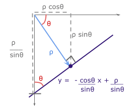

# Hough Transform
Reference: https://sbme-tutorials.github.io/2018/cv/notes/5_week5.html

## Hough Line
Proposed by Paul V.C Hough 1962
* Got [USA Patent](https://patents.google.com/patent/US3069654)
* Originally for line detection
* Extended to detect other shapes like , circle, ellipse etc.

### Original Hough transform (Cartesian Coordinates)
In image space line is defined by the slope m and the y-intercept b
$$
y=mx+b
$$

So to detect the line in the image space we have to define these parameters, which is not applicable in image domain. In the other domain with m and b coordinates, line represent a point from image domain. Points on the same line in image domain will be mapped to lines in Hough domain. These lines intersect with each other in a point with specific values m and b. These values are the slope and y-intercept of original line in image domain.

For example in the following image. Blue point in image domain was mapped to the blue line in Hough domain. The same for red point. Intersection point of blue and red lines in hough domain has the values m and b of the line y=mx+b 

More points that on same line tends to more lines in Hough domain and that will increase voting to the intersection point indicating that there is many points belongs to line in image domain with that slope and y-intercept.  [source](http://what-when-how.com/biomedical-image-analysis/the-hough-transform-biomedical-image-analysis/)

### Alternative Parameter Space (Polar Coordinates)
Due to undefined value of slope for vertical lines in cartesian coordinates, we have to move to polar coordinates. In polar coordinates line is define by $\rho$ and $\theta$ where $\rho$ is the norm distance of the line from origin. $\theta$ is the angle between the norm and the horizontal $x$ axis. The equation of line in terms of $\rho$ and $\theta$ now is
$$
y=−\cos(\theta)\sin(\theta)x+\rho \sin(\theta)
$$
and

$$
\rho=x \cos(\theta)+y \sin(\theta)
$$

The Range of values of $\rho$ and $\theta$:
* $\theta$ in polar coordinate takes value in range of -90 to 90
* The maximum norm distance is given by diagonal distance which is
$$
\rho_{max}=\sqrt{x^2+y^2}
$$
So $\rho$ has values in range from $−\rho_{max}$ to $\rho_{max}$
