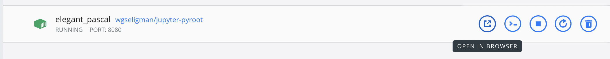
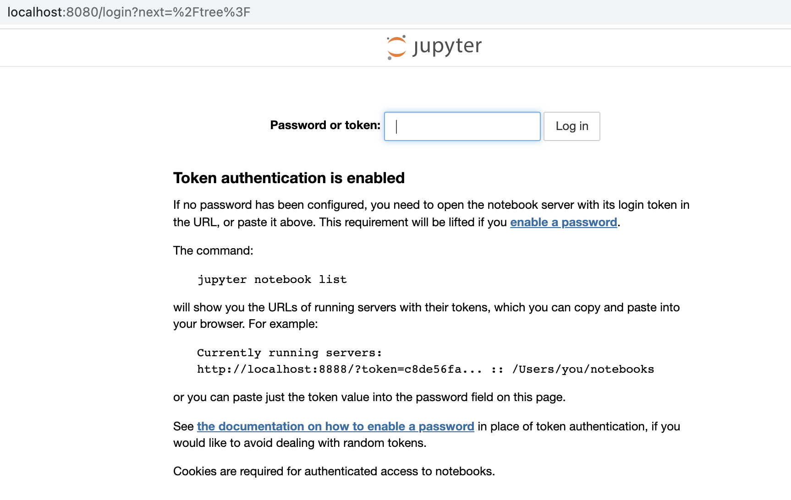
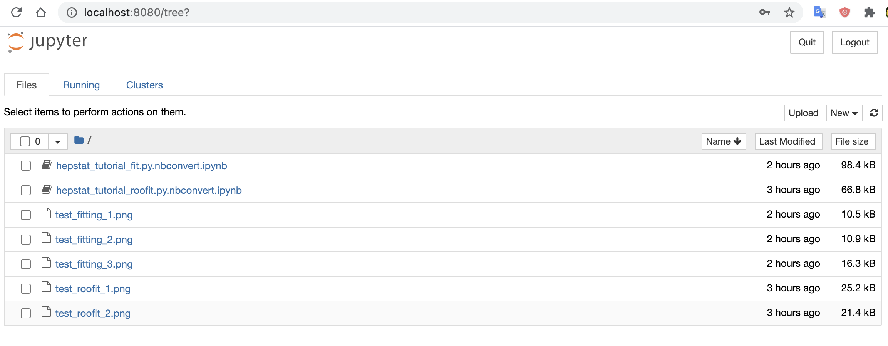
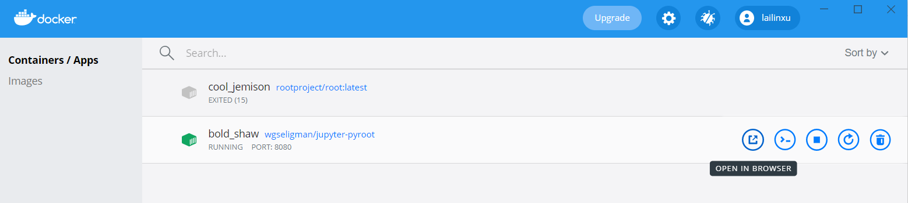
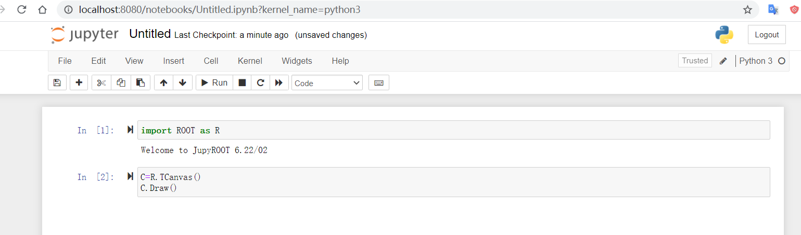

# Set up pyroot using docker


## Installation of ROOT

Download the `root` docker image from [rootproject DockerHub](https://hub.docker.com/r/rootproject/root), either in a Linux/Unix terminal or Winows PowerShell:

```
docker pull rootproject/root
```

### macOS

```
ip=$(ifconfig en0 | grep inet | awk '$1=="inet" {print $2}')
echo $ip
xhost + $ip
```
You should see something like the following
```
192.168.154.154 being added to access control list
```

```
docker run --rm -it  -e DISPLAY=$ip:0 -v /tmp/.X11-unix:/tmp/.X11-unix --user $(id -u)  -v $PWD:/work rootproject/root bash -l
```
Some explanation:
* `-v $PWD:/work` is to mount your current working directory, say `/Users/lailinxu/Local/Work`, to the docker container, and map it to `/work` directory insider the container. So that once you enter the container, if you go to `/work` directory, and read or write any files there, it would be equivalent of reading or writing files to the actual directory of your computer: `/Users/lailinxu/Local/Work`.
* If you don't mount any directories to the container, you won't be able to read from or write files to your computer. They will be lost after you shut down the container.


This will enter the bash mode inside the container. You can run either `root` or `python3`:
```
root
TB   ------------------------------------------------------------------
  | Welcome to ROOT 6.22/06                        https://root.cern |
  | (c) 1995-2020, The ROOT Team; conception: R. Brun, F. Rademakers |
  | Built for linuxx8664gcc on Nov 27 2020, 15:14:08                 |
  | From tags/v6-22-06@v6-22-06                                      |
  | Try '.help', '.demo', '.license', '.credits', '.quit'/'.q'       |
   ------------------------------------------------------------------

root [0] TBrowser b
(TBrowser &) Name: Browser Title: ROOT Object Browser
root [1] .q
```
You should see the browser GUI opens up.

```
pI have no name!@adf84bed54f6:/opt$ python3
Python 3.8.5 (default, Jul 28 2020, 12:59:40) 
[GCC 9.3.0] on linux
Type "help", "copyright", "credits" or "license" for more information.
>>> 
```

### Windows

To enable graphics, like using the `TBrowser` GUI, you need to install [Xming](https://sourceforge.net/projects/xming/) first, following the instruction from the `rootproject` [DockerHub](https://hub.docker.com/r/rootproject/root).

Open the PowerShell to set up `Xming`:
```
cd 'C:\Program Files (x86)\Xming\'
.\Xming.exe :28 -ac
```
This is to set the port `:28` so that the ROOT docker container display could be exported to Xming via this port. You can chose any valid port you want, but rember the port number.

Then you need to find out the IP address of your localost:

```
PS C:\Users\ustc\Docker> Test-Connection -ComputerName (hostname) -Count 1  | Select IPV4Address
```
You should see something like:
```
IPV4Address
-----------
192.168.3.4
```
You would need this IP address later when starting the root container. You can now start the docker conatiner, via:
```
PS C:\Users\ustc\Docker> docker run --rm -it -e DISPLAY=192.168.3.4:28 -v ${PWD}\ROOT:/userhome rootproject/root bash -l
```
Some explanation:
* `DISPLAY` is to use the `Xming` port you set above, with the correct IP address and port number.
* `-v ${PWD}\ROOT:/userhome` is to map your local directory `${PWD}\ROOT`, from your computer, to the container path `/userhome`, so that you can read and write files from or to your computer
* `bash -l` is to start the command line after entering the container.

You can do the following steps:
Open `root` in the command line inside the container:
```
root@ed079919c462:/opt# root
   ------------------------------------------------------------------
  | Welcome to ROOT 6.22/06                        https://root.cern |
  | (c) 1995-2020, The ROOT Team; conception: R. Brun, F. Rademakers |
  | Built for linuxx8664gcc on Nov 27 2020, 15:14:08                 |
  | From tags/v6-22-06@v6-22-06                                      |
  | Try '.help', '.demo', '.license', '.credits', '.quit'/'.q'       |
   ------------------------------------------------------------------

root [0] TBrowser b
(TBrowser &) Name: Browser Title: ROOT Object Browser
root [1] .q
```
If everything works fine, now you should see the `TBrowser` GUI opens up.

Run python inside the container. Note only `python3` is available, not `python2`:
```
root@ed079919c462:/opt# python3
Python 3.8.5 (default, Jul 28 2020, 12:59:40)
[GCC 9.3.0] on linux
Type "help", "copyright", "credits" or "license" for more information.
>>> exit()
```
You can also read and write files from the path `/userhome`, which is equivalent to `${PWD}\ROOT` of your computer:
```
root@ed079919c462:/opt# ls
packages  root
root@ed079919c462:/opt# cd /userhome/
root@ed079919c462:/userhome# ls
ROOT  test.pdf  test.png  test.root
root@ed079919c462:/userhome# pwd
/userhome
```


## Installation of jupyter_pyroot

### macOS

```
docker pull wgseligman/jupyter-pyroot
```

After the image is downloaded, you can launch it like the following
```
docker run -p 8080:8080 -v $PWD/notebook:/work wgseligman/jupyter-pyroot
```

This is to map the directory `$PWD/notebook` of your local computer to the docker container directory `/work`, so that when you enter the docker Jupyter container, you can read and write files from your local computer.

After that, you should see something like the following
```
➜  ROOT docker run -p 8080:8080 -v $PWD/notebook:/work wgseligman/jupyter-pyroot
WARNING: The requested image's platform (linux/amd64) does not match the detected host platform (linux/arm64/v8) and no specific platform was requested
[I 03:48:53.669 NotebookApp] Writing notebook server cookie secret to /root/.local/share/jupyter/runtime/notebook_cookie_secret
[I 03:48:54.903 NotebookApp] JupyterLab extension loaded from /usr/local/lib/python3.6/site-packages/jupyterlab
[I 03:48:54.903 NotebookApp] JupyterLab application directory is /usr/local/share/jupyter/lab
[I 03:48:54.913 NotebookApp] Serving notebooks from local directory: /work
[I 03:48:54.913 NotebookApp] Jupyter Notebook 6.1.5 is running at:
[I 03:48:54.913 NotebookApp] http://c89bcf5a1dc3:8080/?token=d637a62c52ef8510adf946c21fbf8047481a1a55a0447f21
[I 03:48:54.913 NotebookApp]  or http://127.0.0.1:8080/?token=d637a62c52ef8510adf946c21fbf8047481a1a55a0447f21
[I 03:48:54.914 NotebookApp] Use Control-C to stop this server and shut down all kernels (twice to skip confirmation).
[W 03:48:54.932 NotebookApp] No web browser found: could not locate runnable browser.
[C 03:48:54.933 NotebookApp] 
    
    To access the notebook, open this file in a browser:
        file:///root/.local/share/jupyter/runtime/nbserver-1-open.html
    Or copy and paste one of these URLs:
        http://c89bcf5a1dc3:8080/?token=d637a62c52ef8510adf946c21fbf8047481a1a55a0447f21
     or http://127.0.0.1:8080/?token=d637a62c52ef8510adf946c21fbf8047481a1a55a0447f21
```

In your Docker Desktop GUI, under `Containers/App`, you can see the following container is running:



Then you click the first button `OPEN IN BROSWER`, a notebook browser will open up. You need to enter the token, which is printed out to your screen as shown above, which is `d637a62c52ef8510adf946c21fbf8047481a1a55a0447f21` in my case:



after login, you can start the Jupyter notebook:



As expected, files from your local computer directory `$PWD/notebook` will show up. But you can also upload files from here by click the `upload` button on top right. 


### Windows

Install the [jupyter_notebook](https://hub.docker.com/repository/docker/wgseligman/jupyter-pyroot/general) container in PowerShell:

```
PS C:\Users\ustc\Docker> docker pull wgseligman/jupyter-pyroot
```

Start the container:
```
PS C:\Users\ustc\Docker> docker run -p 8080:8080 -v ${PWD}\notebook:/work wgseligman/jupyter-pyroot
```
again here is to mount your local path `${PWD}\notebook` to the container path `/work`.

You should see some print out on your screen.

Then go to your Docker Desktop, and you should see the `jupyter_notebook` container shows up:



Click the `OPEN THE BROSWER` button and the jupyter notebook will show up. Enter the token from the PowerShell screen. Now you can enjoy the notebook:



Do some test to see everything works fine.
